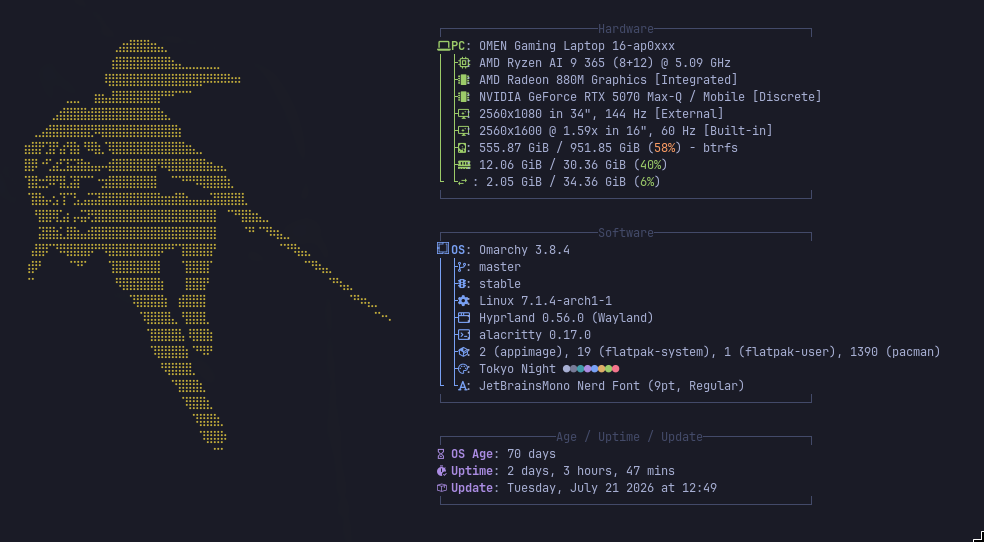

Not long ago I bought a new laptop with an NVIDIA GPU. As part of a promotion I was gifted a copy of Pragmata (a game im loving so far).  
What nobody told me is the rabbit hole I would go in head first just to redeem the code for the game.

## Background

My Linux career started at a very young age as my first-ever computer ran **_Guadalinex Edu_** (an Ubuntu/Debian based distro depending on the version).  
But for the last 6 years, all I used is a mixture of _MacOS_ and a modded version of _Windows 10_, so it's safe to say I'm used to things more or less just working out of the box.  
For the last month I've been using _Omarchy_ and I'm in love with it, but it comes with a series of challenges I wasn't used to (for example having an encrypted SSD that prevents me from dual booting).

## The problem

To redeem the game code I had to go through this steps:

1. Download the NVDIA app and login to my account
2. Link my Steam account
3. Redeem the code on the NVDIA app
4. Follow some on screen instructions to get the game on Steam

These are very simple steps, so where's the catch? The catch is that for this to work the NVIDIA app needs to recognize your GPU and it has to match the GPU of the pc you bought, and that's the problem, NVIDIA app works great on my laptop but for some reason it doesn't recognize the GPU.

After reading online for a while (mainly Reddit threads 💀💀) I found out NVIDIA only supports this redeeming process on Windows machines and it's intended to not work on Linux.

## Things I tried with no success

---

### GPU passthrough to a Windows VM

I already mentioned I'm still catching up with Linux as I've been out of the game for quite some time, keep that in mind.

As virtualbox was already installed on my PC for some classes, and I had a running Windows 10 VM I thought the simplest solution would be to pass my GPU to the VM and redeem the code from there, spoiler: **almost blew up my OS**.

I got to work following a mixture of ChatGPT directions and online guides but, I don't know when, things went south very fast and I accidentally deleted some kernel modules. You can imagine my reaction when all of a sudden the screen went black and I could only access the TTY console.

I blame ChatGPT but in reality I know I shouldn't copy/paste random commands that do unknown things.  
Thankfully everything was alright after reverting the last 2 or 3 commands I blindly pasted in the terminal and rebooting (Omarchy snapshots are amazing btw).

### Creating a bootable Windows USB using Rufus

I tried creating a bootable Windows USB using Rufus, but it didn't work.  
I could only manage to create an installation drive but not a **WindowsToGo USB**.

### Redeeming the code from another computer

As I already said, you can only redeem the code from the computer that has the exact GPU you bought, but I didn't know that at the time.  
A friend of mine offered to redeem it on his PC but it didn't work either.

## The solution

After trying everything that came to mind and having 0 success I stumbled upon this <a
href="https://www.easyuefi.com/wintousb/"
target="\_blank"
rel="noopener noreferrer"> program</a>.

As it only works on Windows I once again started VirtualBox and opened the VM. Once inside and after installing the program I finally managed to create a bootable Windows 10 external SSD.

From this external Windows 10 installation I was able to finally redeem the code and add it to my Steam library.

## Conclusions

NVIDIA and most big tech companies suck. Thankfully (and in big part thanks to Valve) we are closer and closer to Linux being **_"mainstream"_** and having direct support from manufacturers.
